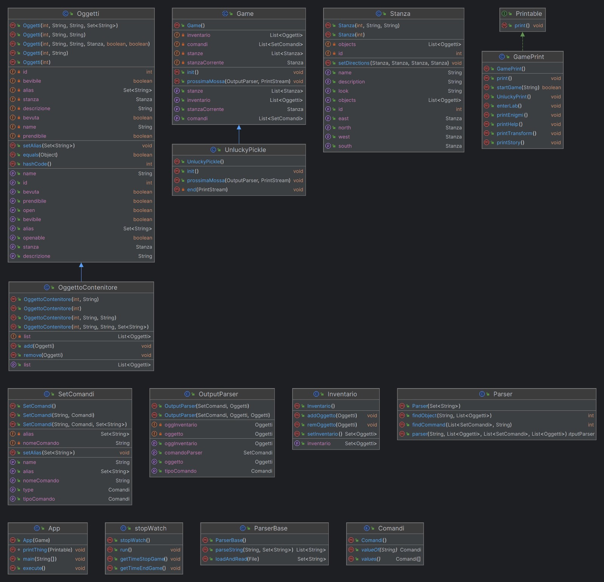

# **DOCUMENTAZIONE**

Questo documento fornisce una documentazione riguardante il progetto realizzato da:

- Catherine Martin Duarte
- Elisa Stufano
- Nicolò Orsi

# INDICE

## 1. Introduzione
L'applicazione è un gioco d'avventura testuale giocabile tramite interfaccia grafica basata su Java e avviabile su terminali Windows, Linux e Mac OS.
Il gioco tratta la disavventura di uno scienzato, che si trova nel mezzo di un bel pasticcio. Sperimentando uno delle sue tante invenzioni, si ritrova con un effetto non desiderato. Magicamente diventa un cetriolo, e deve trovare la soluzione per tornare ad essere un umano. Il gioco è ambientato nella casa dello scienziato, essa è composta da:
-salone
-camera da letto
-bagno 
-cucina
-laboratorio
-stanza segreta
Il compito del giocatore è trovare la soluzione di questo imprevisto capitato allo scienziato. 

## 2. Requisiti funzionali

ID     | TITOLO | DESCRIZIONE
:----: | :-----: |  -------
`RF1`  | Avviare il gioco |  L'utente deve essere in grado di avviare il gioco a partire dalla pagina iniziale
`RF2`  |  Aprire l'inventario | L'utente deve essere in grado di guardare quali oggetti sono presenti nell'inventario
`RF3`  | Muoversi a nord di una stanza | L'utente deve essere in grado di muoversi a nord di una stanza, se questa direzione è possibile
`RF4`  |Muoversi a sud di una stanza |  L'utente deve essere in grado di muoversi a sud di una stanza, se questa direzione è possibile
`RF5`  | Muoversi ad est di una stanza | L'utente deve essere in grado di muoversi a nord di una stanza, se questa direzione è possibile
`RF6`  | Muoversi ad ovest di una stanza |  L'utente deve essere in grado di muoversi a sud di una stanza, se questa direzione è possibile
`RF8`  |  Uscire dal gioco | L'utente deve essere in grado di uscire dalla partita usando il comando apposito fornito
`RF9`  | Guardare una stanza | L'utente deve essere in grado di guardare la descrizione di una stanza e vedere quali oggetti ci sono
`RF9`  | Scrivere nel terminale di input una frase di comando | L'utente deve essere in grado, in qualunque punto della partita, scrivere una frase, la quale possa portare ad un'azione del protagonista nel corso della partita
`RF10` | Prendere un oggetto| L'utente deve essere in grado di prendere un oggetto e riporlo nell'inventario
`RF11` | Chiedere aiuto| L'utente deve essere in grado di visualizzare tutti i comandi possibili del gioco in caso di difficoltà
`RF12` | Avere la lista di indovinelli | L'utente deve essere in grado di avere gli indizi degli oggetti da prendere per aprire la cassettiera
`RF13` |Bere pozione/antidoto| L'utente deve essere in grado di bere la pozione per iniziare il gioco e di bere l'antidoto per risolvere la condizione che ha il protagonista
`RF14` | Aprire oggetti che contengono altri oggetti| L'utente deve essere in grado di aprire un oggetto contenitore per prendere altri oggetti utili per il gioco

## 2.2  Requisiti non funzionali

|  ID     | REQUISITO        | DESCRIZIONE                                                  |
| :---:   | ---------------- | :----------------------------------------------------------- |
| `RNF1`  | Affidabilità | Il sistema è capace di evitare che si verificano errori, malfunzionamenti o che siano prodotti risultati non corretti o inattesi. |
| `RNF2`  | Compatibilità | È necessario essere in possesso di una macchina con uno dei seguenti SO: Windows, Mac OS, distribuzioni Linux |
| `RNF3`  | Efficienza | Il sistema richiede un quantitativo basso di risorse |
| `RNF4`  | Eseguibilità | Per eseguire l'applicazione è necessario disporre di una Java Virtual Machine 8 (o superiore) |
| `RNF5`  | Operabilità | L'applicazione non richiede l'installazione sulla macchina. Si presenta come eseguibile in formato `Jar` e la propria esecuzione avviene tramite interfaccia grafica |
| `RNF6`  | Estendibilità | L'applicazione è predisposta a poter accettare qualsiasi cambiamento o di aggiunta di nuove features |
| `RNF7`  | 
| `RNF8`  | Manutentabilità | L'applicazione è facilmente manutentabile grazie alla modularità delle componenti, ai principi dell'Information Hiding applicati, la medio-alta coesione introdotta e la presentazione separata delle componenti
| `RNF9`  | Modularità | L'applicazione fa uso del concetto di modularità che aiuta a ridurre la complessità del problema e ne facilità l'estendibilità |
| `RNF10` | Riusabilità | Alcuni componenti dell'applicazione potrebbero essere riutilizzati per realizzare giochi simili |
| `RNF11` |Robustezza | Il programma è capace di gestire le situazioni in cui si manifestano errori o eccezioni dovuti a mosse e/o comandi non validi 

## 3. Divisione in Package e Classi Implementate

  Per una corretta modulazione del sistema sono stati creati diversi package:

- Il package *Parser* contiene le classi utili alla verifica lessicale e sintattica dell'input inserito dall'utente. Il parser funziona solamnente per la lingua italiana. Questo package contiene le seguenti classi che comunicano tra loro:

  - OutputParser, la quale si occupa di stampare l'ouput corretto del parser;
  - ParserBase, si occupa di caricare e leggere il file di stopWords e anche di splittare la stringa inserita dall'utente;
  - Parser, la classe contiene tutti i metodi necessari per la ricerca del comando e dell'oggetto nella frase inserita dall'utente
  
- Il package *Timer* contiene una classe fondamentale per l'utilizzo dei trhead:
  - stopWatch, che contiene i metodi per creare e avviare il thread implementato per l'utilizzo del timer
  

- Il package *Type* contiene le diverse entità riscontrabili nel gioco, tra cui:
  - Inventario, che contiene tutti i metodi necessari per la gestione dell'inventario, in particolare per l'inserimento di oggetti e la visualizzazione di esso stesso
  - Oggetti. che contiene tutti i metodi necessari per la gestione degli oggetti di gioco, in particolare quelli utilizzati per progredire e concludere il gioco;
  - SetComandi, che viene utilizzato per gestire tutti  i comandi che si possono utilizzare nel gioco
  - Stanze, che viene utilizzato per gestire tutte le stanze presenti nella mappa del gioco.
  - Game, che contiene tutti gli elementi fondamentali per la gestione dell'avventura testuale, in particolare anche l'utilizzo delle generics. 
  - OggettoContenitore, che si occupa della gestione degli oggetti che a loro volta contengono altri oggetti
  
- Il package *App* contiene le classi fondamentali del gioco, tra cui una in particolare che contiene il main:
  - UnluckyPickle contiene i metodi per la costruzione del gioco e il metodo di prossimaMossa grazie al quale l'utente è in grado di avere un riscontro dei comandi inseriti 
  - App, contiene il main e parte da qui l'esecuzione del gioco;

## 4. Diagramma UML

|

