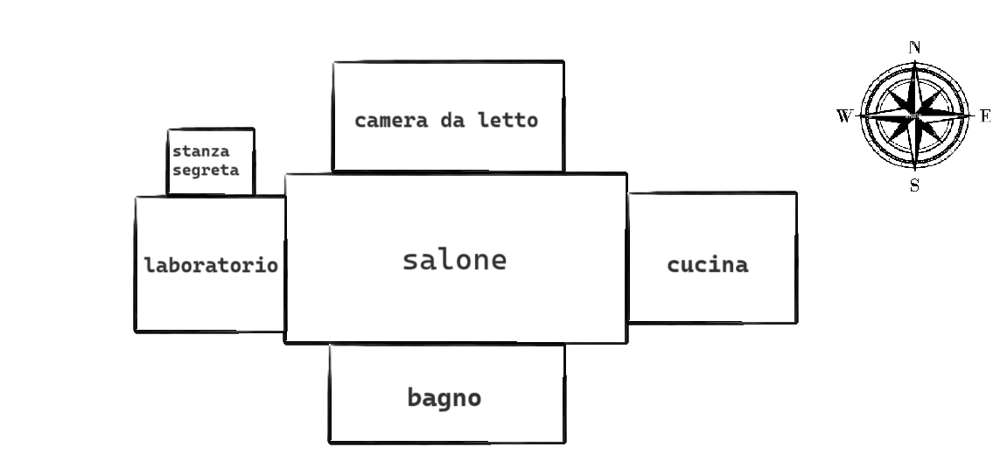

# **DOCUMENTAZIONE**

Questo documento fornisce una documentazione riguardante il progetto realizzato da:

- Catherine Martin Duarte
- Elisa Stufano
- Nicolò Orsi

# INDICE
1. [Introduzione](#1-Introduzione)
2. [Requisiti](#2-Requisiti-funzionali)
3. [Requisiti non funzionali](#3-Requisiti-non-funzionali)
4. [Divisione in Package e Classi Implementate](#4-Divisione-in-Package-e-Classi-Implementate)
5. [Diagramma UML](#5-Diagramma-UML)
6. [Mappa Gioco](#6-Mappa-Gioco)
7. [Specifica algebrica - Lista](#7-Specifica-algebrica-Lista)
   1. [Specifica Sintattica Lista](#71-Specifica-Sintattica-Lista)
    2. [Specifica Semantica Lista](#72-Specifica-Semantica-Lista)
8. [Scelte Progettuali](#8-Scelte-Progettuali)
9. [Javadoc](#9-Javadoc)

## 1. Introduzione
L'applicazione è un gioco d'avventura testuale giocabile tramite interfaccia grafica basata su Java e avviabile su terminali Windows, Linux e Mac OS.
Il gioco tratta la disavventura di uno scienzato, che si trova nel mezzo di un bel pasticcio. Sperimentando una delle sue tante invenzioni, si ritrova con un effetto non desiderato. Magicamente, diventa un cetriolo e deve trovare la soluzione per tornare ad essere un umano. Il gioco è ambientato nella casa dello scienziato. Essa è composta da:
-salone
-camera da letto
-bagno 
-cucina
-laboratorio
-stanza segreta
Il compito del giocatore è trovare la soluzione di questo imprevisto capitato allo scienziato. 

## 2. Requisiti funzionali

ID     | TITOLO | DESCRIZIONE
:----: | :-----: |  -------
`RF1`  | Avviare il gioco |  L'utente deve essere in grado di avviare il gioco a partire dalla pagina iniziale
`RF2`  |  Aprire l'inventario | L'utente deve essere in grado di guardare quali oggetti sono presenti nell'inventario
`RF3`  | Muoversi a nord di una stanza | L'utente deve essere in grado di muoversi a nord di una stanza, se questa direzione è possibile
`RF4`  |Muoversi a sud di una stanza |  L'utente deve essere in grado di muoversi a sud di una stanza, se questa direzione è possibile
`RF5`  | Muoversi ad est di una stanza | L'utente deve essere in grado di muoversi a nord di una stanza, se questa direzione è possibile
`RF6`  | Muoversi ad ovest di una stanza |  L'utente deve essere in grado di muoversi a sud di una stanza, se questa direzione è possibile
`RF8`  |  Uscire dal gioco | L'utente deve essere in grado di uscire dalla partita usando il comando apposito fornito
`RF9`  | Guardare una stanza | L'utente deve essere in grado di guardare la descrizione di una stanza e vedere quali oggetti ci sono
`RF9`  | Scrivere nel terminale di input una frase di comando | L'utente deve essere in grado, in qualunque punto della partita, scrivere una frase, la quale possa portare ad un'azione del protagonista nel corso della partita
`RF10` | Prendere un oggetto| L'utente deve essere in grado di prendere un oggetto e riporlo nell'inventario
`RF11` | Chiedere aiuto| L'utente deve essere in grado di visualizzare tutti i comandi possibili del gioco in caso di difficoltà
`RF12` | Avere la lista di indovinelli | L'utente deve essere in grado di avere gli indizi degli oggetti da prendere per aprire la cassettiera
`RF13` |Bere pozione/antidoto| L'utente deve essere in grado di bere la pozione per iniziare il gioco e di bere l'antidoto per risolvere la condizione che ha il protagonista
`RF14` | Aprire oggetti che contengono altri oggetti| L'utente deve essere in grado di aprire un oggetto contenitore per prendere altri oggetti utili per il gioco

## 3  Requisiti non funzionali

|  ID     | REQUISITO        | DESCRIZIONE                                                  |
| :---:   | ---------------- | :----------------------------------------------------------- |
| `RNF1`  | Affidabilità | Il sistema è capace di evitare che si verificano errori, malfunzionamenti o che siano prodotti risultati non corretti o inattesi. |
| `RNF2`  | Compatibilità | È necessario essere in possesso di una macchina con uno dei seguenti SO: Windows, Mac OS, distribuzioni Linux |
| `RNF3`  | Efficienza | Il sistema richiede un quantitativo basso di risorse |
| `RNF4`  | Eseguibilità | Per eseguire l'applicazione è necessario disporre di una Java Virtual Machine 8 (o superiore) |
| `RNF5`  | Operabilità | L'applicazione non richiede l'installazione sulla macchina. Si presenta come eseguibile in formato `Jar` e la propria esecuzione avviene tramite interfaccia grafica |
| `RNF6`  | Estendibilità | L'applicazione è predisposta a poter accettare qualsiasi cambiamento o di aggiunta di nuove features |
| `RNF7`  | 
| `RNF8`  | Manutentabilità | L'applicazione è facilmente manutentabile grazie alla modularità delle componenti, ai principi dell'Information Hiding applicati, la medio-alta coesione introdotta e la presentazione separata delle componenti
| `RNF9`  | Modularità | L'applicazione fa uso del concetto di modularità che aiuta a ridurre la complessità del problema e ne facilità l'estendibilità |
| `RNF10` | Riusabilità | Alcuni componenti dell'applicazione potrebbero essere riutilizzati per realizzare giochi simili |
| `RNF11` |Robustezza | Il programma è capace di gestire le situazioni in cui si manifestano errori o eccezioni dovuti a mosse e/o comandi non validi 

## 4. Divisione in Package e Classi Implementate

  Per una corretta modulazione del sistema sono stati creati diversi package:

- Il package *Parser* contiene le classi utili alla verifica lessicale e sintattica dell'input inserito dall'utente. Il parser funziona solamnente per la lingua italiana. Questo package contiene le seguenti classi che comunicano tra loro:

  - OutputParser, la quale si occupa di stampare l'ouput corretto del parser;
  - ParserBase, si occupa di caricare e leggere il file di stopWords e anche di splittare la stringa inserita dall'utente;
  - Parser, la classe contiene tutti i metodi necessari per la ricerca del comando e dell'oggetto nella frase inserita dall'utente
  
- Il package *Timer* contiene una classe fondamentale per l'utilizzo dei trhead:
  - stopWatch, che contiene i metodi per creare e avviare il thread implementato per l'utilizzo del timer
  

- Il package *Type* contiene le diverse entità riscontrabili nel gioco, tra cui:
  - Inventario, che contiene tutti i metodi necessari per la gestione dell'inventario, in particolare per l'inserimento di oggetti e la visualizzazione di esso stesso
  - Oggetti. che contiene tutti i metodi necessari per la gestione degli oggetti di gioco, in particolare quelli utilizzati per progredire e concludere il gioco;
  - SetComandi, che viene utilizzato per gestire tutti  i comandi che si possono utilizzare nel gioco
  - Stanze, che viene utilizzato per gestire tutte le stanze presenti nella mappa del gioco.
  - Game, che contiene tutti gli elementi fondamentali per la gestione dell'avventura testuale, in particolare anche l'utilizzo delle generics. 
  - OggettoContenitore, che si occupa della gestione degli oggetti che a loro volta contengono altri oggetti
  
- Il package *App* contiene le classi fondamentali del gioco, tra cui una in particolare che contiene il main:
  - UnluckyPickle contiene i metodi per la costruzione del gioco e il metodo di prossimaMossa grazie al quale l'utente è in grado di avere un riscontro dei comandi inseriti 
  - App, contiene il main e parte da qui l'esecuzione del gioco;

## 5. Diagramma UML

## 6. Mappa Gioco

## 7. Specifica Algebrica Lista

Nel nostro progetto viene utilizzata molto frequentemente la struttura algebrica lista. Questa viene utilizata per la lista degli oggetti dell'inventario, la lista delle stanze che ci sono nel gioco e la lista di comandi possibili da usare.
Una lista è una sequenza finita, anche vuota, di elementi dello stesso tipo. 
La differenza col concetto di insieme è che mentre in un insieme un elemento non può comparire più di una volta, nella lista uno stesso elemento può comparire più volte, in posizione diverse. 

## 7.1 Specifica Sintattica Lista

Tipi: lista, posizione, boolean, tipoelem

Operatori:
- crealista : ( ) → lista
- listavuota : (lista) → boolean
- leggilista : (posizione, lista) → tipoelem
- scrivilista : (tipoelem,posizione,lista) → lista
- primolista : (lista) → posizione
- finelista : (posizione, lista) → boolean
- succlista : (posizione, lista) → posizione
- predlista : (posizione, lista) → posizione
- inslista : (tipoelem,posizione,lista) → lista
- canclista : (posizione, lista) → lista

## 7.2 Specifica Semantica Lista
Tipi
- Lista: insieme delle sequenze l = < a1, a2, ... , an>, n>=0, di elementi di tipo tipoelem dove l'elemento i-esimo ha valore a(i) e posizione pos(i)
- boolean: insieme dei valori di verità

Operatori
- crealista = l'
  - POST: l' = <> (sequenza vuota)
- listavuota(l) = b
  - POST: b = true se l= < >
  - b = false altrimenti
- leggilista(p, l) = a
  - PRE: p = pos(i) 1 <= i <= n
  - POST: a = a(i)
- scrivilista(a, p, l) = l'
  - PRE: p = pos(i) 1 <= i <= n
  - POST: l' = < a1, a2, ... , ai-1, a, ai+1, ... , an>
- primolista(l) = p
  - PRE: listavuota(l) = false
  - POST: p = pos(1)
- finelista(p, l) = b
  - PRE: p = pos(i) 1 <= i <= n+1
  - POST: b = true se p = pos(n+1)
  - b= false altrimenti
- succlista(p, l) = q
  - PRE: p = pos(i) 1 <= i <= n
  - POST: q = pos(i+1)
- predlista(p, l) = q
  - PRE: p = pos(i) 2 <= i <=n
  - POST: q = pos(i-1)
- inslista(a, p, l) = l'
  - PRE: p = pos(i) 1 <= i <= n+1
  - POST: l' = < a1, a2, ... , ai-1, a, ai, ai+1, ... , an>, se 1 <= i <= n
  - l' = <a1, a2, ... ,an, a > , se i = n+1
  - (e quindi l' = < a > se i = 1 e l = < >)
- canclista(p, l) = l'
  - PRE: p = pos(i) 1 <= i <= n
  - POST: l' = < a1, a2, ... , ai-1, ai+1, ... , an>

## 8. Scelte Progettuali

Alcuni punti chiavi del nostro progetto sono descritti nei prossimi paragrafi:

All'avviare del gioco un cronometro viene inizializzato per misurare il tempo trascorso durante il gioco. Ci sono alcune considerazioni riguardo questa scelta progettuale:
La classe stopWatch estende la classe Thread, il che implica che il cronometro sarà eseguito in un thread separato quando viene chiamato il metodo start(). Tuttavia, potrebbe essere utile considerare l'implementazione dell'interfaccia Runnable invece di estendere direttamente Thread, per favorire una migliore progettazione dell'ereditarietà. Inolte, abbiamo deciso di utilizzare System.nanoTime() per misurare il tempo, in quanto fornisce una precisione molto elevata.

La classe ParserBase è progettata per gestire stopwords e analizzare stringhe. La classe si concentra su due funzionalità distinte: la lettura di un file di stopwords e l'analisi di stringhe per rimuovere le stopwords. Questa pratica di progettazione rende la classe più modulare e riutilizzabile. L'utilizzo di un Set (Set<String>) per contenere le stopwords assicura che non ci siano duplicati e semplifica le operazioni di ricerca. Inoltre, l'utilizzo di toLowerCase() ci assicura che le stopwords e la stringa da analizzare siano trattate in modo case-insensitive, evitando problemi di corrispondenza.

Il metodo prossimaMossa() gestisce la logica delle mosse del gioco in base al comando dell'utente. All'interno di questo metodo facciamo uso di oggetti, come OutputParser e GamePrint, per rappresentare lo stato del gioco e la stampa dei messaggi. Facciamo utilizzo anche della gestione delle eccezioni, ad esempio con la cattura di Exception durante la lettura della password per accedere al laboratorio.

All'interno della classe App, è presente  un'espressione lambda per creare oggetti di tipo Printable e stampare un messaggio. Le espressioni lambda in Java consentono di definire funzioni anonime (senza un nome) in modo più conciso e leggibile.
La logica di fine gioco utilizza la chiamata a watch.getTimeEndGame() per calcolare e visualizzare il tempo trascorso alla fine del gioco, stampando un messaggio di saluto. La rappresentazione grafica di fine partita aggiunge un tocco divertente alla chiusura del gioco.

Fanno parte del gioco oggetti che a loro volta contengono altri oggetti. La classe OggettoContenitore estende la classe Oggetti, sfruttando l'ereditarietà per ereditare attributi e comportamenti di base degli oggetti nel gioco. Questa scelta promuove la riusabilità del codice e mantiene una struttura coesa. La classe utilizza una lista per memorizzare gli oggetti contenuti all'interno del contenitore. Questa scelta offre flessibilità nella gestione dinamica degli oggetti contenuti e semplifica le operazioni di aggiunta e rimozione. In generale, questa classe offre un'implementazione flessibile e modulare degli oggetti contenitori all'interno del contesto del gioco. Le scelte progettuali in questo caso riflettono principi come l'ereditarietà, l'incapsulamento e la facilità d'uso.

La classe Game costituisce il nucleo del gioco e offre un'architettura flessibile per gestire comandi, stanze, inventario e la logica del gioco. La classe è dichiarata come astratta, indicando che deve essere estesa da sottoclassi concrete. Questa scelta consente di fornire una struttura di base comune per tutti i tipi di giochi, mentre le sottoclassi possono implementare dettagli specifici.
La presenza di un metodo astratto "init" richiede alle sottoclassi di fornire un'implementazione per l'inizializzazione del gioco. Questo metodo è essenziale per configurare il gioco iniziale, le stanze, gli oggetti, ecc., offrendo un punto di estensione chiave per personalizzare il gioco. La classe utilizza un oggetto "PrintStream" per la visualizzazione degli output. Questa scelta consente una gestione più flessibile delle operazioni di stampa e può essere facilmente adattata per l'output su diverse piattaforme. 
In generale, la classe Game è progettata in modo modulare e offre un'interfaccia chiara per l'estensione e la personalizzazione dei giochi. Le scelte progettuali riflettono principi di incapsulamento, astrazione ed estensibilità.

## 9. Javadoc

La documentazione del progetto UnluckyPickle è arricchita e resa accessibile attraverso Javadoc, uno strumento di generazione automatica della documentazione per codice sorgente Java. La Javadoc fornisce una descrizione esaustiva di classi, metodi, campi e altri elementi del codice, migliorando la comprensione del progetto per gli sviluppatori, facilitando la manutenzione e favorendo la collaborazione.

**Come è Generata:**

La documentazione Javadoc è generata automaticamente dal codice sorgente Java arricchito con annotazioni speciali. Gli sviluppatori incorporano commenti Javadoc direttamente nel codice, descrivendo l'uso e il funzionamento di classi e metodi. L'esecuzione di un comando Javadoc attraverso strumenti come Maven o da riga di comando converte questi commenti in una documentazione strutturata, solitamente in formato HTML.

**Posizione nella Struttura del Progetto:**

La documentazione generata da Javadoc risiede all'interno della directory **"target"** del progetto. Questa collocazione è standard e consente una separazione chiara tra il codice sorgente e la documentazione. Gli sviluppatori possono accedere facilmente alla documentazione generata aprendo il file **"index.html"** nella directory "target" attraverso un browser web. Questa pratica facilita la distribuzione del software, poiché la documentazione è inclusa nella struttura del progetto.

### Vantaggi della Javadoc:

**Chiarezza e Coerenza:** La Javadoc promuove la creazione di documentazione chiara e coerente direttamente correlata al codice sorgente.

**Facilita la Comprensione:** Gli sviluppatori possono rapidamente comprendere l'utilizzo e il comportamento delle classi e dei metodi grazie alla documentazione dettagliata.

**Aggiornamenti Sincronizzati:** Poiché la Javadoc è generata automaticamente dal codice sorgente, rimane sincronizzata con le modifiche al codice, garantendo che la documentazione sia sempre aggiornata.
La Javadoc all'interno del folder "target" non solo arricchisce la comprensione del progetto per gli sviluppatori, ma rappresenta anche una risorsa fondamentale per la manutenzione e l'evoluzione continua del software.
